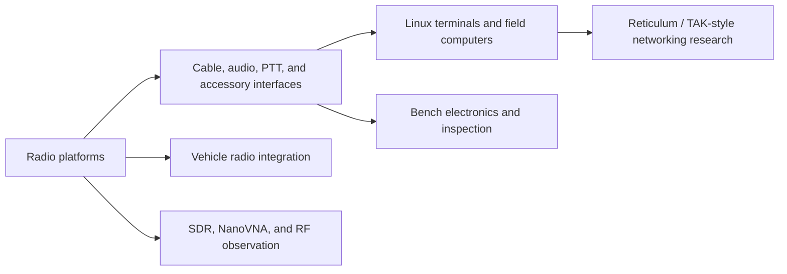

# Tactical Radio Systems Portfolio

Public-safe portfolio index for tactical radio systems, RF/electronics integration, constrained IP networking, and field communications work.

## Purpose

This portfolio is organized around one theme: connecting radio hardware, physical interfaces, and Linux/networking workflows into practical field systems. The projects below are intentionally sanitized. They show architecture, process, constraints, and hands-on integration work without publishing operational radio details, key material, private infrastructure, or sensitive identifiers.

## Portfolio Map

| Project | Focus | What It Shows |
|---|---|---|
| [P25 Reticulum Radio IP Lab](https://github.com/jjudge213/p25-reticulum-radio-ip-lab) | P25 CAI research, constrained IP transport, Linux routing, Reticulum messaging | Radio-to-terminal networking research, vendor-behavior comparison, and application-layer testing over a constrained radio-linked IP path |
| [Harris XG-100M Vehicle Integration](https://github.com/jjudge213/harris-xg100m-vehicle-integration) | Vehicle communications installation around a Harris XG-100M | Control-head/radio placement, speaker integration, serviceability, operator access, and public-safe planning for power/RF/accessory paths |
| [Radio Electronics Interface Lab](https://github.com/jjudge213/radio-electronics-interface-lab) | Radio interface hardware, cabling, SDR/RF, electronics bench work | Audio/PTT breakout work, accessory-interface cable fabrication, connector modification, microscope/breadboard inspection, HackRF spectrum observation, and manpack hardware concepts |

## Relevant Capability Areas

- Tactical and digital radio systems, including P25-oriented lab work.
- RF systems integration, SDR observation, NanoVNA antenna checks, and spectrum-level analysis.
- Linux terminal networking, manual routing, and constrained IP transport testing.
- Radio interface development: audio, speaker, microphone, PTT, accessory-interface, and connector work.
- Vehicle communications installation: control-head access, serviceability, audio usability, and future power/RF planning.
- Electronics bench work: soldering, breadboarding, connector inspection, microscope review, and documentation.
- Systems documentation with public-safe diagrams, outcome summaries, and clear boundaries around sensitive material.

## Resume Bullets

- Integrated tactical radio, RF/electronics, Linux networking, and field troubleshooting experience into a public-safe systems-integration portfolio aligned to L3Harris-style communications roles.
- Documented P25 radio-to-terminal IP experimentation, Reticulum messaging tests, and vendor-specific radio constraints using sanitized diagrams and outcome summaries.
- Built and documented Harris XG-100M vehicle integration work, including control-head/radio placement, audio usability, serviceability, and future power/RF/accessory planning.
- Fabricated and documented radio interface hardware including audio/PTT breakouts, accessory-interface cabling, connector modifications, and bench inspection workflows.
- Applied disciplined redaction boundaries for tactical communications work, excluding operational frequencies, radio IDs, key material, codeplugs, credentials, and private infrastructure.

## Public Safety Boundary

These repositories do not publish operational frequencies, talkgroups, radio IDs, serials, encryption keys, key-fill material, codeplugs, restricted manuals, private infrastructure details, credentials, private location data, or employer/customer proprietary material.

Diagrams use placeholders and sanitized architecture. Project write-ups focus on the engineering process, integration choices, constraints, and lessons learned.

## Resume Positioning

This portfolio is most relevant to roles involving tactical communications, RF systems integration, field systems, radio/networking support, vehicle communications installation, Linux/network troubleshooting, or technician-engineer hybrid work.
